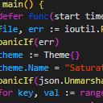
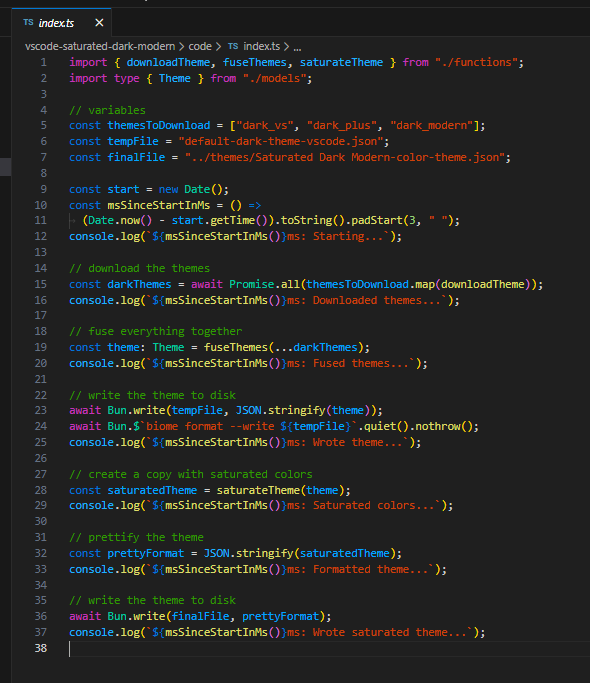

# Saturated Dark Modern

  
   
  <b>A vibrant twist on the default Visual Studio Code experience.</b>

 

**Saturated Dark Modern** takes the beloved defaults—Dark Modern, Dark Plus, and
Dark VS—and algorithmically boosts their saturation. The result is a familiar
yet energetic theme that improves contrast and makes syntax highlighting pop.

## Why use this theme?

- **Vibrant & Clear**: Syntax colors are boosted by **2.3x**, making code
  structures easier to distinguish.
- **Familiar**: It retains the core "Dark Modern" feel, so you don't have to
  relearn color associations.
- **High Contrast**: UI elements are saturated by **1.5x**, adding depth to the
  editor interface.

## Installation

1. Open **Extensions** in VS Code (`Ctrl+Shift+X` or `Cmd+Shift+X`).
2. Search for `Saturated Dark Modern`.
3. Click **Install**.
4. Select the theme from the **Themes** list.
